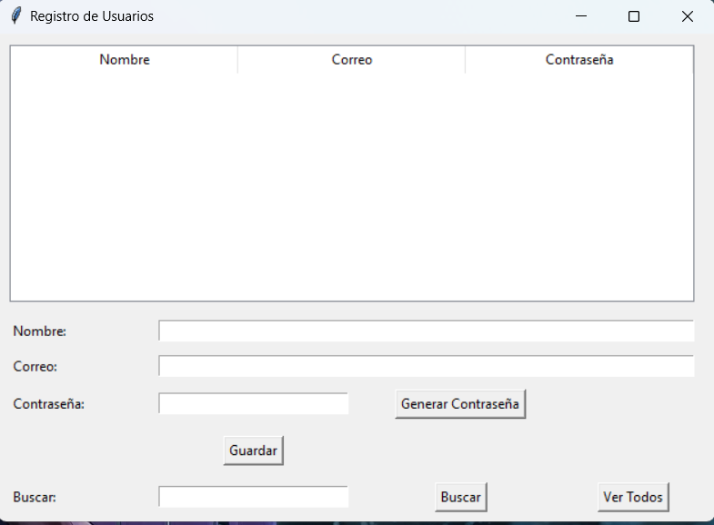

## OrganizadorDeListas

#### Este proyecto esta desarrollado en python para hacer un gestor de contraseñas que te da un archivo para ver lo guardado

puedes editar los datos desde la aplicación y tambien si tienes muchos datos puedes buscarlo por el nombre

### Miniatura

